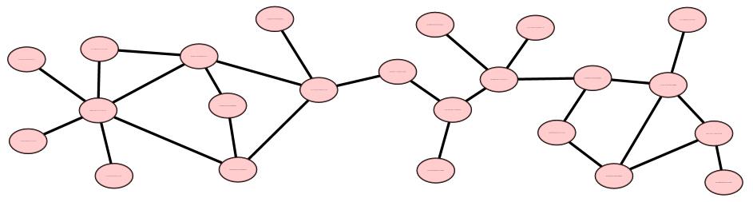

# Network Generation
Graphical networks are generic: natural language parse trees are graphs.
So are the chains of axioms and logical deductions in a mathematical
proof. So are plans for movement and motion through 3D space, as well
as plans for accomplishing some more abstract action: planning a party
or planning a coordinated disaster relief effort. Biological reaction
pathways, involving genes, proteins and other molecules, are graphical
networks as well. So are social networks. What these all have in common
is an underlying set of allowed (or preferred) attachments, moves,
changes or state transitions, as well as hard and soft constraints on
what attachments, moves are possible.

The goal of the code in this repo is to generate such networks, given
a (weighted) collection of constraints and/or transition rules and/or
a syntactical (grammatical) description of the system. More precisely,
it is to effect a transformation from a complex of initial states into
a complex of final states, with the initial and final complexes possibly
being of fundamentally different types. In between the start and end
is a networked web of interconnected moves, transitions, constraints.
In essence, this is as a constraint satisfaction solver which allows
probabilistic weighting and guiding, and allows the general problem
to be described as a collection of syntactical rules or moves (AKA
rules of inference, axioms, judgments).

Currently focused on natural language generation; however, the theory
is generic, and is intended for use on any deduction or induction
problem. The image above was generated with [this example
code](./examples/export-to-gml.scm); it shows a random network, with
all links and nodes being of the same type, and the node arity (number
of connections) being Zipfian-distributed (that's why most nodes have
only one connection, and only one has six connections).

## Sheaves, germs and syntax
To accomplish the above, snapshots or instances of the interacting
system are assumed to be describable as a graph (a generic directed,
labeled, typed, weighted graph, possibly containing loops). Such
generic graphs can be decomposed into pieces, which can be roughly
envisioned as jigsaw-puzzle pieces, having mating connectors.  In
the typical case, each vertex in the graph corresponds to a jigsaw
puzzle-piece, with "half-edges" or connectors connecting it to it's
nearest neighbors. The pieces may be all alike, or all different,
limited or unlimited in number, having connectors of only a few,
or of many different types. In general, the pieces are NOT 2D, but
of arbitrary dimension (that is, there may or may not be constraints
on the crossing of links).

This vertex plus half-edge description of a graph is so general that
it encodes a very large collection of concepts from mathematics and
the sciences. The graphical interpretation allows concepts from
cellular homology to be applied, most importantly, those of sheaf
theory. In effect, the rules for assembling jigsaw puzzle pieces are
precisely the sheaf gluing axioms.  The pairing together of connectors
resembles the contraction of raised/lowered indexes in a tensor algebra.
That is, individual jigsaw-puzzle pieces are instances of tensors.
Since a partially-assembled jigsaw looks like a particularly
complicated single piece, this description applies to any
category-theoretic category with a tensor product.

One particularly notable analogy to mating together a pair of connectors
is that of beta-reduction (in lambda calculus and functional programming
languages).  The pair is of typed-variable to value!  That is, one of
the connectors can be taken as a variable (in a function or lambda
expression) and the other connector is any "value" that can be
substituted in for that variable. The "shapes" of the connectors enforce
the requirement that the type of the value must correspond to the type
of the variable. Unlike the variable/value distinction, thinking in
terms of connectors makes beta-reduction more obviously symmetric.
One can either apply a function to some values, or one can insert some
values into a function: these are effectively the same, and there is
no longer any particular necessity to distinguish between these two
operations.

The puzzle-piece analogy is sufficient to capture and encode the concept
of syntax, in all of it's fullness. For example, the Backus-Nauer Form
(BNF) of (context-free) syntax rules are readily encoded as
jigsaw-shapes: the production arrow is the piece itself; the expression
on the left is just a connector; the term or expression on the right
is just a conjunction of one or more connectors. A disjunction of terms
on the right correspond to a disjunction of jigsaw-pieces: for a given
connector tab on the left, one chooses one-and-only-one on the right.
(This is consistent with the sheaf-gluing axioms, and resembles the
rules of linear logic: viz. the no-cloning and the no-deleting theorems
of dagger-compact categories.)

The grammar of natural language can also be encoded as jigsaw pieces;
the foundational papers of the
[Link Grammar](https://www.abisource.com/projects/link-grammar/)
theory of natural language explicitly present parsing as the
joining-together of jigsaw pieces.

In light of all of this, one can roughly say that the jigsaw piece
analogy is the natural setting for the extension of Curry-Howard
correspondence to a broad range of settings.

## Parsing and generation
Graph generation via syntax rules can be understood as a search of a
problem space. However, unlike traditional path search, where the start
and end-points are of the same general kind (e.g. traveling salesman)
here, path is transformative, and the start and endpoints might be of
entirely different classes. For example, in (natural language) parsing,
one starts with a linear sequence of words, and concludes with a parse
tree.  In natural language generation, one begins with a bag of semantic
concepts, and generates a word-sequence capturing that semantics. The
act of parsing or generation bridges between these two representations.
The bridge itself is not a single ordered path or chain, but is also
a network of connections and constraints that must be satisfied.

Parsing and generation can be thought of as a special case of the more
general act of theorem-proving. In theorem-proving, one has a collection
of axioms and inference rules (represented as jigsaw pieces!) together
with a hypothesis (a collection of unconnected connectors), with the
goal of a proof being to arrive at an appropriate assembly culminating
in a "boundary" of "true" (all remaining unconnected connectors can
be joined to a "true" jigsaw-piece, or rather, being all-true connectors).
Unlike parsing, in theorem-proving, the jigsaw pieces can be freely
chosen (as long as they fit together). In parsing, the jigsaw pieces
must correspond to the words in a sentences, and the word-order must
be preserved.

## Markov logic and Bayesian blankets
[Theorem proving](https://en.wikipedia.org/wiki/Automated_theorem_proving)
(and generally,
[constraint satisfaction](https://en.wikipedia.org/wiki/Constraint_satisfaction))
are known hard problems, and so, defacto this is what this project is
aiming at. All the pitfalls apply, including combinatoric explosion,
algorithmic heuristics, etc. On top of all of this, a very explicit aim
is that each of the jigsaw pieces and connectors are weighted, so that
certain kinds of assemblies are preferred over others. Were it not for
this weighting, one might consider using existing constraint satisfaction
solvers. For example, Answer-Set Programming (ASP) is a particularly
convenient way of specifying discrete, crisp-logic constraints. More
generally, one might even consider SAT solvers, or maybe even
[Satisfiability Modules Theories (SMT)](https://en.wikipedia.org/wiki/Satisfiability_modulo_theories)
solvers.  Once on throws in weightings, none of the existing SMT solvers
appear to be adequate for the job.  Thus, this project.

The goal of saying "weighting" is to avoid saying "probability". In
reality (based on long experience) the weights do resemble
log-probabilities, in that it is very convenient to assign a single
preference score that is a sum of weights. There are some strong
theoretical arguments that the correct weighting is the Boltzmann
distribution, and thus, the assembled jigsaw pieces form a Markov
blanket. Insofar as the jigsaw pieces can encode logic, the resulting
blankets can be taken to be Markov Logic blankets. Again, the formation,
discovery and data-mining of such blankets is a known-hard problem,
filled to the brim with combinatoric explosions, and eminently lacking
in general tractable algorithms. C'est la vie.

Unlike Markov logic, there is no presumption here that the jigsaw pieces
are logical expressions. In particular, there is no constraint that the
network be directed and acyclic. Thus, again, MLN solvers and Bayesian
network solvers (belief networks, decision networks) are insufficient to
tackle the problem at hand.  Although the jigsaw connectors can have a
polarity (and thus connections can be directed), there is no presumed
constraint that the resulting graph is acyclic or directed (or planar,
or has any other long-range properties that aren't encoded in the connector
scheme.)

# Strategic Development Plan
The above provides an very abstract description of the project, and
emphasizes just how daunting it is. The abstract goals are not
achievable in a handful of programmer-years; it is potentially
some dozens if not hundreds of scientist-years of research effort.
Thus, a narrower, tighter focus is needed.

## Characterizing learning systems
This project is motivated by a need to characterize and evaluate
unsupervised learning systems, specifically, learning systems for
natural language. The normal course for such projects is to obtain
a natural language corpus, usually in English, that has been annotated
by professional linguists (or rather, their undergrad and
gradate-student workforce) and then evaluate any given system against
this corpus. Practice has shown that this is a poor way of evaluating
the quality of natural-language parsing, understanding, inference,
question-answering and generation. Considerable confusion and ambiguity
abounds.

In place of this, it seems best to evaluate such systems against
artificial languages; ideally, random languages where various aspects
can be tightly controlled. For example: the size of the vocabulary.
The relative distribution of nouns, verbs, adjectives. The number of
meanings of words (viz, words that happen to have the same spelling,
but have different syntactic behaviors, from which one infers different
meanings). One might also vary the number of synonymous words: words
that behave the same way, syntactically, but have different spellings.
Or even synonymous phrases. The Zipfian distribution of natural language
is a confounding factor: rare words simply don't offer enough examples
to allow easy learning. Thus, one wishes to evaluate learning algorithms
for different distributions.

Thus, the immediate goal of this project is to generate a corpus of
"sentences" from a randomly-generated, constrained artificial grammar.
One then asks of the grammar learner can learn the known grammar from
this corpus of sentences. In can then evaluate the learner in much the
same way that one evaluates audio amplifiers, looking for high-fidelity.

Specifically, this is for the OpenCog
[language learning subsystem](https://github.com/opencog/learn).

## Generating natural language
If instead one starts with a fixed grammar, e.g. that of English,
and specifies a handful of words, then generation is useful for
converting a bag of concepts into a sequence of spoken sentences.
That is, to move from semantic networks to surface structure.
For example, given the abstract concepts "Ben", "pizza" and "to eat",
and the grammar for the English language, one wishes to generate
any plausible sentence that embeds these concepts. Ideally, the sentence
is short and not too flowery, and perhaps has a constraint on tense,
number, and other linguistic features.

The plan is to tackle this after basic generation sort-of-works-ish.

## Abstract generation
As sketched above, logic, reasoning, inference, and deduction can
all be characterized as the assembly of jigsaw pieces. It is hoped
that the above system will be general enough to "easily" provide
an alternative implementation for several existing OpenCog systems,
specifically, for
[PLN](https://github.com/opencog/pln) (Probabilistic Logic Networks),
the [URE](https://github.com/opencog/ure) (Unified Rule Engine) and
the OpenPsi rule scheduling system.

# Architecture
In what follows, the terms "section", "germ" and "disjunct" will be
used somewhat interchangeably. The differences are as follows:
* A "germ" is just one item (a "point"), with a list of connectors
  on it.
* Commonly, an object (a "point") will have several germs associated
  with it these are disjoined from one-another, and are thus called
  "disjuncts".  The disjoin is in the sense of a menu-entry: you can
  pick one, but only one.
* A "section" is a collection of multiple germs, connected to
  one-another. Such a collection will typically have unconnected
  connectors, and thus behaves much like one giant-sized germ.
  It's like a partially-assembled jigsaw-puzzle: the assembled
  portions behave much like single giant-sized pieces. The term
  "section" refers to a "section of a sheaf": starting from one
  particular germ, one can extend outwards "horizontally" in a
  coherent fashion. Coherency requires that all of the gluing
  axioms of a sheaf must be satisfied.

## Germs
With this in mind, germs are represented as
[OpenCog Atoms](https://wiki.opencog.org/w/Atomese)
as follows:
```
   Section
       Atom "foo"
       ConnectorSeq
           Connector
               Atom "bar"
               ConnectorDir "+"
           Connector
               ...
```
Here, `Atom "foo"` and `Atom "bar"` can be any Atomese Atom; for
natural language, these will typically be either `WordNode`s for
individual words, or `WordClassNode`s for collections of words
(nouns, verbs, etc.). The user is free to choose what kind of Atoms
to use here; there is no pre-established convention (except for
words, when dealing with linguistic graphs).

Two germs can be connected together if and only if they have
matching connectors of opposite polarity. Thus,
```
    Connector
        Atom "bar"
        ConnectorDir "+"
```
can only connect to
```
    Connector
        Atom "bar"
        ConnectorDir "-"
```
The polarity is indicated with `ConnectorDir`. Several different kinds
of polarity are possible, and are in common use. By convention, the +/-
polarities indicate linear order: something must come to the left/right
of the other.  The h/d polarities indicate head/dependent relationships:
a directed edge. The v/g polarities indicate variable/ground
relationships: a variable that can be beta-reduced with a particular
value.  The polarity pairs are by convention only; they are not
mandated by the system.

This representation is discussed in greater detail in the
[Connectors and Sections](https://wiki.opencog.org/w/Connectors_and_Sections)
wiki page.

## Implementation
There is an inherent combinatorial explosion, which will certainly be
CPU-intensive, and require considerable algorithmic sophistication,
e.g. pruning, to make things run fast. Thus, in anticipation of this,
the prototype implementation will be in C++.  There were/are three other
design choices:

* Use the Link-Grammar internal code. This code is now extremely fast,
  and uses some very robust pruning algos. It has two drawbacks: it
  assumes sequential order (i.e. words in a sentence) and has a large
  number of in-built assumptions aimed at language parsing, rather than
  generation.

* Write everything in scheme (or even python), and use the pattern
  matcher for all heavy lifting. This does not seem tenable at this
  time.

* Locate some existing system that meets many of the requirements, and
  modify it to fit. I don't know of any system that even comes close to
  meeting any of the requirements.  If you do, **please let me know**!
  I have no desire to reinvent any wheels, here.


# Version 0.1.0
The current code implements a breadth-first aggregation algorithm.
It provides two search modes: a deterministic explorer that will
exhaustively generate all finite "unambiguous" graphs, and an
random network explorer, useful for sampling from larger grammars
that cannot be fully explored via exhaustive enumeration.  It passes
all unit tests. See
[opencog/generate/README](opencog/generate/) for algo details.

The deterministic explorer is works well, and is effectively complete.
It explores all possible graphs up to a given depth (maximum diameter),
and thus provides an exhaustive listing, even in the case of grammars
to might generate an infinite number of graphs.

The random explorer seems to work "well enough", but is still missing
desirable features. These will be added as the need arises.  Foremost
are additional tunable parameters to control the statistical
distribution of the generated graphs.

This has not yet been tried on anything but small, toy grammars, and
may fail pathologically, or get bogged down with poor performance,
for large, complex grammars.

Upcoming plans are to provide constraints to generate planar graphs.
An extension to force linear order (so as to obtain sequences, e.g.
word sequences) is also required.

Some of the missing features are listed in the github issues list.

## Building & testing
The code here presumes the [AtomSpace](https://github.com/opencog/atomspace)
as a pre-requisite. The AtomSpace is a (hyper-)graph database with
assorted advanced features not found in other graph databases; this is
why it's used here.

Building and testing works exactly the same way as the AtomSpace; build
that, and then build the stuff here in the same way.

## Examples
Jump to the [examples](examples) directory!

The [demo](demo) directory contains a simple epidemic-network simulation
model. It demonstrates different aspects of the AtomSpace, such as value
flows, as well as random network generation. There's even a
[blog post](https://blog.opencog.org/2020/04/22/covid-19-modelling-and-random-social-networks/)
that you might want to read first.
