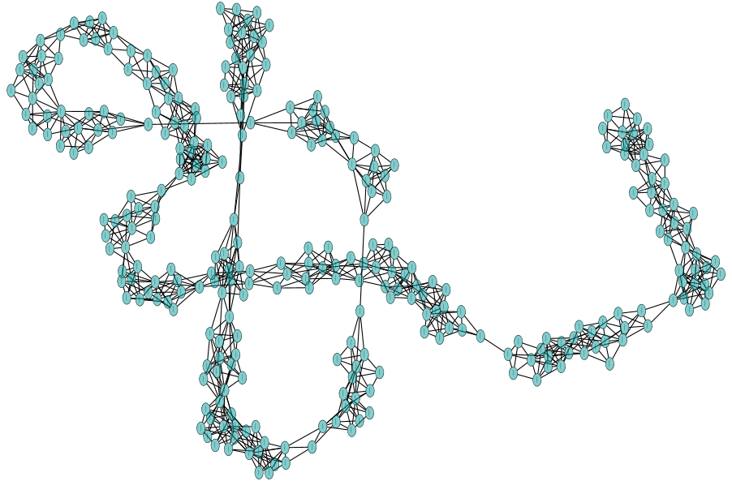

Covid-19 Demo
--------------
Demo of a random social network with a SEIR Covid-19 simulation.

 SEIR == "susceptible", "exposed", "infected", and "recovered".

This is a demo, only! It is demonstrating several different AtomSpace
programming techniques, one of which is the brand-new (version 0.1)
random network generator. Another is Value Flows: the use of Values
for holding mutable state, and flowing that state through a network.
It is assumed that the reader is already familiar with the basics of
the OpenCog AtomSpace! This demo **could** be enhanced to do actual
scientific exploration; see "making this useful", below.

This demo generates a random "social network", consisting of two types
of relationships: "friends" and "strangers". It adopts a simple SEIR
model of disease transmission and progression along this network.
The model itself is a (simple) hand-coded state-transition machine.

There is a
[blog post](https://blog.opencog.org/2020/04/22/covid-19-modelling-and-random-social-networks/)
that reviews this demo.  It touches on the high-lites of the demo,
avoiding all of the grunge needed to get actual, working code. Thus,
reading it is recommended before diving into the code.

Making this Useful
------------------
This is a demo, not a final finished product.

There's no whizzy visualization of the disease progression, or the
resulting stats. You can visualize snapshots of the network with
CytoScape or Gephi, but it won't be animated as the disease spreads.

There's no statistical analysis performed, and no graphs or curves are
drawn. The demo shows how to generate the raw data, not how to analyze
raw data. There are plenty of tools designed for statistical analysis.
Use those.

A few notes about scheme, python and Atomese. This demo would appear
to be written ins scheme. It could have just as eassily been written
in python, without changing it's basic form (the AtomSpace has python
bindings.) It may seem hard to beleive, but the choice of language
doesn't really much matter. That's because all of the hard work is
done in Atomese.

Atomese is a graphical programming language, and it was designed for
automation. Atomese expressions are graphs; they live as graphs in the
AtomSpace graph database. Atomese encodes a type of "Abstract Syntax
Tree" (see [Wikipedia](https://en.wikipedia.org/wiki/Abstract_syntax_tree))
and such a representation is useful for all of the reasons that the
Wikipedia article says they are. But it also means that "coding" in
Atomese can sometimes feel unusual. Like: "Why can't I just code in
python? It would be so much easier!" -- Well, but that misses the
point. And the point is, again: Atomese was designed for automation.

What this really means is that the graphs are meant to be easy for other
algorithms to manipulate. It's designed for ease-of-use by machines,
not for humans! The style is more barren, unadorned, without
short-cuts. Its a bit verbose at times. That's OK, machines don't mind
verbosity and tedium.

Consider, for example, a graphical editor - something where you can
drag-n-drop, hand-draw interacting bubble diagrams. Something easy
to use - something a medical professional could get the hang of in
a few hours - something where a disease model could be sketched out
with bubbles and lines and flow-charts. The goal of Atomese is that
it becomes easy -- really easy -- to convert such diagrams into
executable code. That's what Atomese is designed to do.

In this demo, the disease progression model is written in Atomese.
This is the model that a graphical GUI WYSIWYG whizz-bang system
would generate.

Atomese enables other, more abstract approaches. Consider an automatic
model explorer: a system that automatically creates a variety of
different disease progression models, and then explores how each
model works. The model generator might try to fit an existing dataset.
Alternately, it could mutate models so as to obtain certain
characteristics.  This moves beyond just adjusting some parameters
in some hand-created, hypothesized model. This is not just some
monte-carlo search or machine-learning hill-climbing for parameter
tuning.  This is a whole-sale creation of previously non-existent
code. Atomese allows software to read, understand, mutate, modify
and write programs.

Thus, in reading the code, keep in mind that there is nothing special
about the SEIR model; its a stand-in for what could be a generic,
arbitrary state transition machine. Such machines can be hand-coded,
of course, but the interesting application is when they are generated
from other sources.

Last but not least: keep in mind that the network generator is
currently at version 0.1, and is not yet as versatile, flexible and
powerful as it could be. The parameter settings used in the demo
generate networks that are long and thin. Very long and thin. Like
the coiled-up network below.

